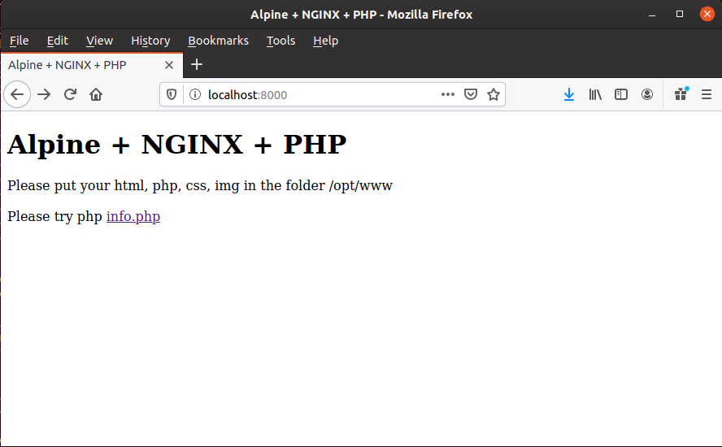
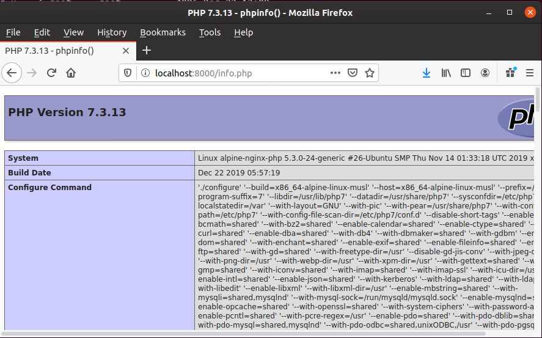

# Alpine NGINX + PHP
## Introduction
This is an Alpine Linux docker that is based on the Hacking-Lab CTF `alpine-base` image. 

## Specifications
* based on alpine latest + NGINX + PHP7
* with s6 startup handling
* with dynamic ctf flag handling in `environment variables`
* with dynamic ctf flag handling in `files`

## Purpose
This NGINX docker will work as web and php server and dynamic flags derrived from ENV or FILE

## Template `docker-compose.yml`
```
version: '3.4'

services:
  alpine-nginx-php-hobo:
    image: REGISTRY_BASE_URL/alpine-nginx-php:latest
    hostname: 'hobo'
    environment:
      - "domainname=idocker.REALM_DOMAIN_SUFFIX"
    labels:
      - "traefik.port=80"
      - "traefik.frontend.rule=Host:hobo.REALM_DOMAIN_SUFFIX"
      - "traefik.protocol=http"
    env_file:
      - ./UUID.env
    volumes:
      - ./UUID.gn:/goldnugget/UUID.gn
```


## TESTING `alpine-nginx-php-example`
* UUID = 987200aa-e54b-45cc-888e-3fbef03e89a2
* example subfolder in alpine-nginx-php-example

```
ibuetler@demide:/opt/git/alpine-nginx-php$ ls -al 
total 56
drwxr-xr-x  6 ibuetler ibuetler 4096 Dez 22 13:15 .
drwxr-xr-x 14 ibuetler ibuetler 4096 Dez 22 12:43 ..
drwxr-xr-x  4 ibuetler ibuetler 4096 Dez 22 13:19 alpine-nginx-php-example
-rwxr-xr-x  1 ibuetler ibuetler   56 Dez 22 12:45 build.sh
-rw-r--r--  1 ibuetler ibuetler  415 Dez 22 13:15 docker-compose.yml
-rw-r--r--  1 ibuetler ibuetler  638 Dez 22 13:15 Dockerfile
drwxr-xr-x  2 ibuetler ibuetler 4096 Dez 22 12:45 flag-deploy-scripts
drwxr-xr-x  8 ibuetler ibuetler 4096 Dez 22 12:45 .git
-rw-r--r--  1 ibuetler ibuetler 8880 Dez 22 12:48 README.md
drwxr-xr-x  6 ibuetler ibuetler 4096 Dez 22 13:14 root
-rw-r--r--  1 ibuetler ibuetler   26 Dez 22 12:45 UUID.env
-rw-r--r--  1 ibuetler ibuetler   26 Dez 22 12:45 UUID.gn

ibuetler@demide:/opt/git/alpine-nginx-php$ cd alpine-nginx-php-example/

ibuetler@demide:/opt/git/alpine-nginx-php/alpine-nginx-php-example$ ls -al 
total 200
drwxr-xr-x 4 ibuetler ibuetler   4096 Dez 22 13:19 .
drwxr-xr-x 6 ibuetler ibuetler   4096 Dez 22 13:15 ..
-rw-r--r-- 1 ibuetler ibuetler     26 Dez 22 13:12 987200aa-e54b-45cc-888e-3fbef03e89a2.env
-rw-r--r-- 1 ibuetler ibuetler     26 Dez 22 13:12 987200aa-e54b-45cc-888e-3fbef03e89a2.gn
-rwxr-xr-x 1 ibuetler ibuetler     60 Dez 22 13:19 build.sh
-rw-r--r-- 1 ibuetler ibuetler    333 Dez 22 13:12 docker-compose.yml
-rw-r--r-- 1 ibuetler ibuetler    638 Dez 22 13:12 Dockerfile
drwxr-xr-x 2 root     root       4096 Dez 22 12:55 htdocs
drwxr-xr-x 6 ibuetler ibuetler   4096 Dez 22 13:07 root
-rw-r--r-- 1 ibuetler ibuetler  38743 Dez 22 13:10 screenshot01.png
-rw-r--r-- 1 ibuetler ibuetler 126266 Dez 22 13:11 screenshot02.png

```

Content of `docker-compose.yml` with a real UUID
```
ibuetler@demide:/opt/git/alpine-nginx-php/alpine-nginx-php-example$ cat docker-compose.yml 

version: '3.4'

services:
  alpine-nginx-php:
    image: hackinglab/alpine-nginx-php:latest
    hostname: 'alpine-nginx-php'
    env_file:
      - ./987200aa-e54b-45cc-888e-3fbef03e89a2.env
    volumes:
      - ./987200aa-e54b-45cc-888e-3fbef03e89a2.gn:/goldnugget/987200aa-e54b-45cc-888e-3fbef03e89a2.gn
    ports:
      - 8000:80


```

Content of UUID.env (do not change this!!!)
```
ibuetler@demide:/opt/git/alpine-nginx-php/alpine-nginx-php-example$ cat 987200aa-e54b-45cc-888e-3fbef03e89a2.env
GOLDNUGGET=SED_GOLDNUGGET
```

Content of UUID.gn (do not change this!!!)
```
ibuetler@demide:/opt/git/alpine-nginx-php/alpine-nginx-php-example$ cat 987200aa-e54b-45cc-888e-3fbef03e89a2.gn 
GOLDNUGGET=SED_GOLDNUGGET
```

Content of `flag-deploy-scripts` folder
* deploy-env-flag.sh = your code how you want to deploy the flag in the CTF docker
* deploy-file-flag.sh = your code how you want to deploy the flag in the CTF docker

```
ibuetler@demide:~/Repository/alpine-base-example$ ls -al flag-deploy-scripts/
total 16
drwx------ 2 ibuetler ibuetler 4096 Dez 10 09:58 .
drwxr-xr-x 4 ibuetler ibuetler 4096 Dez 10 09:59 ..
-rwx------ 1 ibuetler ibuetler   89 Dez 10 09:58 deploy-env-flag.sh
-rwx------ 1 ibuetler ibuetler   90 Dez 10 09:58 deploy-file-flag.sh
```


## BUILDING with `docker build`
```
root@demide:/opt/git/alpine-nginx-php/alpine-nginx-php-example# bash build.sh 
Sending build context to Docker daemon  201.7kB
Step 1/6 : FROM hackinglab/alpine-base:latest
 ---> 6c0f507d6a3b
Step 2/6 : MAINTAINER Ivan Buetler <ivan.buetler@compass-security.com>
 ---> Using cache
 ---> 48510b16108a
Step 3/6 : RUN apk add --no-cache         vim         curl 	nginx         expect 	openssl 	shadow 	php7-common 	php7 	php7-fileinfo 	php7-fpm 	php7-json 	php7-mbstring 	php7-openssl 	php7-session 	php7-simplexml 	php7-xml 	php7-xmlwriter 	php7-zlib 	php7-ldap 	php7-zip
 ---> Using cache
 ---> 7eb944e01c53
Step 4/6 : ADD root /
 ---> Using cache
 ---> f09247e4a5a5
Step 5/6 : RUN apk add --update nginx &&     rm -rf /var/cache/apk/* &&     chown -R nginx:www-data /var/lib/nginx &&     chown -R nginx:www-data /opt/www
 ---> Using cache
 ---> 0c2e61323198
Step 6/6 : EXPOSE 80
 ---> Using cache
 ---> 7f818b46a3b1
Successfully built 7f818b46a3b1
Successfully tagged hackinglab/alpine-nginx-php:latest
``` 

## TESTING docker-compose.yml using `docker-compose config`
```
root@demide:/opt/git/alpine-nginx-php/alpine-nginx-php-example# docker-compose config
services:
  alpine-nginx-php:
    environment:
      GOLDNUGGET: SED_GOLDNUGGET
    hostname: alpine-nginx-php
    image: hackinglab/alpine-nginx-php:latest
    ports:
    - published: 8000
      target: 80
    volumes:
    - /opt/git/alpine-nginx-php/alpine-nginx-php-example/987200aa-e54b-45cc-888e-3fbef03e89a2.gn:/goldnugget/987200aa-e54b-45cc-888e-3fbef03e89a2.gn:rw
version: '3.4'

```

## RUNNING container using `docker-compose up`
```
root@demide:/opt/git/alpine-nginx-php/alpine-nginx-php-example# docker-compose up
Starting alpine-nginx-php-example_alpine-nginx-php_1 ... done
Attaching to alpine-nginx-php-example_alpine-nginx-php_1
alpine-nginx-php_1  | [s6-init] making user provided files available at /var/run/s6/etc...exited 0.
alpine-nginx-php_1  | [s6-init] ensuring user provided files have correct perms...exited 0.
alpine-nginx-php_1  | [fix-attrs.d] applying ownership & permissions fixes...
alpine-nginx-php_1  | [fix-attrs.d] 01-resolver-resolv: applying... 
alpine-nginx-php_1  | [fix-attrs.d] 01-resolver-resolv: exited 0.
alpine-nginx-php_1  | [fix-attrs.d] done.
alpine-nginx-php_1  | [cont-init.d] executing container initialization scripts...
alpine-nginx-php_1  | [cont-init.d] 10-adduser: executing... 
alpine-nginx-php_1  | =================================
alpine-nginx-php_1  | 
alpine-nginx-php_1  | =================================
alpine-nginx-php_1  | USERNAME not defined - will use default username hacker
alpine-nginx-php_1  | adduser: user 'hacker' in use
alpine-nginx-php_1  | 
alpine-nginx-php_1  | -------------------------------------
alpine-nginx-php_1  | GID/UID
alpine-nginx-php_1  | -------------------------------------
alpine-nginx-php_1  | User uid:    2000
alpine-nginx-php_1  | User gid:    2000
alpine-nginx-php_1  | -------------------------------------
alpine-nginx-php_1  | 
alpine-nginx-php_1  | [cont-init.d] 10-adduser: exited 0.
alpine-nginx-php_1  | [cont-init.d] 20-config: executing... 
alpine-nginx-php_1  | ================== make /config ==========
alpine-nginx-php_1  | total 20
alpine-nginx-php_1  | drwxrwxr-x    3 hacker   hacker        4096 Dec 22 12:24 .
alpine-nginx-php_1  | drwxr-xr-x    6 hacker   hacker        4096 Dec 22 12:12 ..
alpine-nginx-php_1  | -rw-rw-r--    1 hacker   hacker        1076 Dec 22 12:12 fastcgi_params
alpine-nginx-php_1  | -rw-r--r--    1 root     root           648 Dec 22 12:24 nginx.conf
alpine-nginx-php_1  | drwxrwxr-x    2 hacker   hacker        4096 Dec 22 12:19 site-confs
alpine-nginx-php_1  | total 12
alpine-nginx-php_1  | drwxrwxr-x    2 hacker   hacker        4096 Dec 22 12:24 .
alpine-nginx-php_1  | drwxrwxr-x    3 hacker   hacker        4096 Dec 22 12:24 ..
alpine-nginx-php_1  | -rw-r--r--    1 root     root           470 Dec 22 12:24 default
alpine-nginx-php_1  | sed for php.ini
alpine-nginx-php_1  | [cont-init.d] 20-config: exited 0.
alpine-nginx-php_1  | [cont-init.d] 30-resolver: executing... 
alpine-nginx-php_1  | [cont-init.d] 30-resolver: exited 0.
alpine-nginx-php_1  | [cont-init.d] 40-resolver: executing... 
alpine-nginx-php_1  | [cont-init.d] 40-resolver: exited 0.
alpine-nginx-php_1  | [cont-init.d] 50-install: executing... 
alpine-nginx-php_1  | [cont-init.d] 50-install: exited 1.
alpine-nginx-php_1  | [cont-init.d] 99-add-flag: executing... 
alpine-nginx-php_1  | 
alpine-nginx-php_1  | ====== testing for flag in environment variable =======
alpine-nginx-php_1  | flag found in environment variable GOLDNUGGET=SED_GOLDNUGGET
alpine-nginx-php_1  | what do you want to do with the flag in the environment variable?
alpine-nginx-php_1  | please define what you want to do with the flag in /flag-deploy-scripts/deploy-env-flag.sh
alpine-nginx-php_1  | executing /flag-deploy-scripts/deploy-env-flag.sh
alpine-nginx-php_1  | put your commands to deploy the env based flag here
alpine-nginx-php_1  | the variable $GOLDNUGGET contains the dynamic flag
alpine-nginx-php_1  | 
alpine-nginx-php_1  | ====== testing for flag in /goldnugget folder ======
alpine-nginx-php_1  | flag file found in /goldnugget
alpine-nginx-php_1  | total 4
alpine-nginx-php_1  | -rw-r--r--    1 go-dnsma go-dnsma        26 Dec 22 12:12 987200aa-e54b-45cc-888e-3fbef03e89a2.gn
alpine-nginx-php_1  | what do you want to do with the flag file?
alpine-nginx-php_1  | please define what you want to do with the flag in /flag-deploy-scripts/deploy-file-flag.sh
alpine-nginx-php_1  | executing /flag-deploy-scripts/deploy-file-flag.sh
alpine-nginx-php_1  | put your commands to deploy the file based flag here
alpine-nginx-php_1  | the /goldnugget/*.gn contains the flag
alpine-nginx-php_1  | 
alpine-nginx-php_1  | =============================================
alpine-nginx-php_1  | [cont-init.d] 99-add-flag: exited 0.
alpine-nginx-php_1  | [cont-init.d] done.
alpine-nginx-php_1  | [services.d] starting services
alpine-nginx-php_1  | [services.d] done.
```

## Screenshot Running Container
* Content of /opt/www in container

Apache + NGINX + PHP


PHP INFO()


## Conclusion
The alpine-nginx-php docker can take flags via ENV or via FILE

## Who takes care of the flag? 
Hacking-Lab CTF docker containers are spinned up by a service called `docker manager`. The `docker manager` will create a random token `uuid` will create random values and sets the flags throughout the ENV or FILE attribute.
